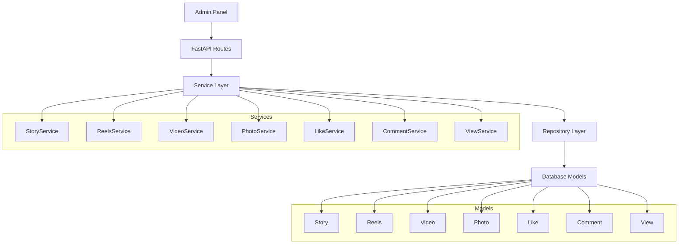
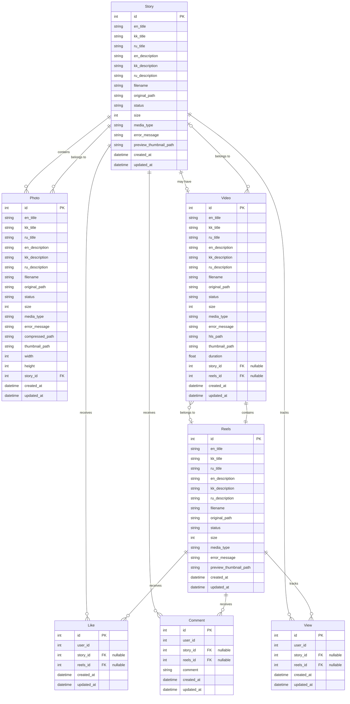
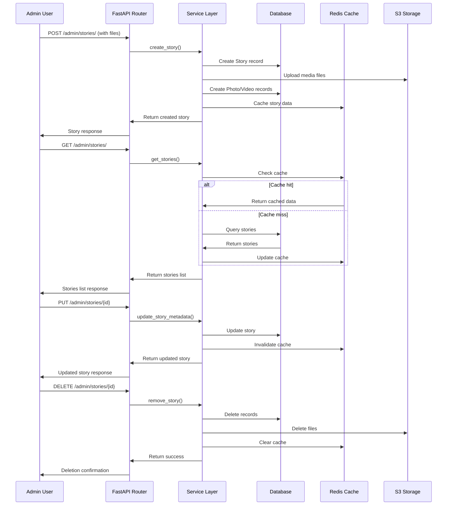

# Streaming_Kairat - Админская панель CRUD

Полное руководство по созданию и использованию административной панели для управления всеми сущностями платформы Streaming_Kairat.

## 📋 Содержание

- [Обзор архитектуры](#обзор-архитектуры)
- [Структура моделей](#структура-моделей)
- [CRUD операции](#crud-операции)
- [API Endpoints для админки](#api-endpoints-для-админки)
- [Примеры использования](#примеры-использования)
- [Схемы данных](#схемы-данных)
- [Настройка и запуск](#настройка-и-запуск)

## Обзор архитектуры

Административная панель построена на основе FastAPI с использованием SQLModel для ORM и поддерживает полный CRUD для всех сущностей системы.

### Архитектура системы



### Связи между моделями



## Структура моделей

### Базовые классы

```python
# BaseModel - содержит id, created_at, updated_at
# MediaMixin - содержит поля для мультиязычного контента
class MediaMixin:
    en_title: str
    kk_title: str  
    ru_title: str
    en_description: str
    kk_description: str
    ru_description: str
    filename: str
    original_path: str
    status: MediaStatus
    size: int
    media_type: MediaType
    error_message: Optional[str]
```

### Основные модели

1. **Story** - Истории (коллекции фото с опциональным видео)
2. **Reels** - Короткие видеоролики  
3. **Video** - Видеофайлы
4. **Photo** - Фотографии
5. **Like** - Лайки пользователей
6. **Comment** - Комментарии пользователей
7. **View** - Просмотры контента

## CRUD операции

### 1. Stories CRUD

```python
# web/api/api_v1/endpoints/admin/stories.py

from fastapi import APIRouter, Depends, HTTPException, UploadFile, File, Form
from typing import List, Optional
from web.apps.stories.service import StoryService
from web.api.deps import get_story_service

router = APIRouter(prefix="/admin/stories", tags=["admin-stories"])

@router.post("/", response_model=StoryResponse)
async def create_story(
    files: List[UploadFile] = File(...),
    en_title: str = Form(...),
    kk_title: str = Form(...),
    ru_title: str = Form(...),
    en_description: str = Form(...),
    kk_description: str = Form(...),
    ru_description: str = Form(...),
    story_service: StoryService = Depends(get_story_service)
):
    """Создание новой истории с файлами"""
    return await story_service.create_story(
        files=files,
        media_type=MediaType.STORIES,
        en_title=en_title,
        kk_title=kk_title,
        ru_title=ru_title,
        en_description=en_description,
        kk_description=kk_description,
        ru_description=ru_description
    )

@router.get("/", response_model=List[StoryResponse])
async def list_stories(
    limit: int = 20,
    offset: int = 0,
    story_service: StoryService = Depends(get_story_service)
):
    """Получение списка всех историй"""
    return await story_service.get_stories()

@router.get("/{story_id}", response_model=StoryResponse)
async def get_story(
    story_id: int,
    story_service: StoryService = Depends(get_story_service)
):
    """Получение истории по ID"""
    return await story_service.get_story(story_id)

@router.put("/{story_id}", response_model=StoryResponse)
async def update_story(
    story_id: int,
    update_data: StoryUpdateSchema,
    story_service: StoryService = Depends(get_story_service)
):
    """Обновление метаданных истории"""
    return await story_service.update_story_metadata(story_id, update_data)

@router.delete("/{story_id}")
async def delete_story(
    story_id: int,
    story_service: StoryService = Depends(get_story_service)
):
    """Удаление истории"""
    success = await story_service.remove_story(story_id)
    if not success:
        raise HTTPException(status_code=404, detail="Story not found")
    return {"message": "Story deleted successfully"}
```

### 2. Reels CRUD

```python
# web/api/api_v1/endpoints/admin/reels.py

@router.post("/", response_model=ReelResponse)
async def create_reel(
    file: UploadFile = File(...),
    en_title: str = Form(...),
    kk_title: str = Form(...),
    ru_title: str = Form(...),
    en_description: str = Form(...),
    kk_description: str = Form(...),
    ru_description: str = Form(...),
    reels_service: ReelsService = Depends(get_reels_service)
):
    """Создание нового рилса"""
    return await reels_service.create_reel(
        file=file,
        media_type=MediaType.REELS,
        en_title=en_title,
        kk_title=kk_title,
        ru_title=ru_title,
        en_description=en_description,
        kk_description=kk_description,
        ru_description=ru_description
    )

@router.get("/", response_model=List[ReelResponse])
async def list_reels(
    params: ReelListQueryParams = Depends(),
    reels_service: ReelsService = Depends(get_reels_service)
):
    """Получение списка всех рилсов"""
    return await reels_service.get_reels(params)

@router.get("/{reels_id}", response_model=ReelResponse)
async def get_reel(
    reels_id: int,
    reels_service: ReelsService = Depends(get_reels_service)
):
    """Получение рилса по ID"""
    return await reels_service.get_reel(reels_id)

@router.put("/{reels_id}", response_model=ReelResponse)
async def update_reel(
    reels_id: int,
    update_data: ReelUpdateSchema,
    reels_service: ReelsService = Depends(get_reels_service)
):
    """Обновление метаданных рилса"""
    return await reels_service.update_reel_metadata(reels_id, update_data)

@router.delete("/{reels_id}")
async def delete_reel(
    reels_id: int,
    reels_service: ReelsService = Depends(get_reels_service)
):
    """Удаление рилса"""
    success = await reels_service.remove_reel(reels_id)
    if not success:
        raise HTTPException(status_code=404, detail="Reel not found")
    return {"message": "Reel deleted successfully"}
```

### 3. Videos CRUD

```python
# web/api/api_v1/endpoints/admin/videos.py

@router.post("/", response_model=VideoResponse)
async def create_video(
    file: UploadFile = File(...),
    media_type: MediaType = Form(...),
    story_id: Optional[int] = Form(None),
    reels_id: Optional[int] = Form(None),
    en_title: str = Form(...),
    kk_title: str = Form(...),
    ru_title: str = Form(...),
    en_description: str = Form(...),
    kk_description: str = Form(...),
    ru_description: str = Form(...),
    video_service: VideoService = Depends(get_video_service)
):
    """Создание нового видео"""
    video = await video_service.upload_video(
        file=file,
        media_type=media_type,
        story_id=story_id,
        reels_id=reels_id,
        en_title=en_title,
        kk_title=kk_title,
        ru_title=ru_title,
        en_description=en_description,
        kk_description=kk_description,
        ru_description=ru_description
    )
    return await video_service.save_video_to_db(video)

@router.get("/", response_model=List[VideoResponse])
async def list_videos(
    limit: int = 20,
    offset: int = 0,
    video_service: VideoService = Depends(get_video_service)
):
    """Получение списка всех видео"""
    return await video_service.get_videos()

@router.get("/{video_id}", response_model=VideoResponse)
async def get_video(
    video_id: int,
    video_service: VideoService = Depends(get_video_service)
):
    """Получение видео по ID"""
    return await video_service.get_video(video_id)

@router.put("/{video_id}/status", response_model=VideoResponse)
async def update_video_status(
    video_id: int,
    status: MediaStatus,
    error_message: Optional[str] = None,
    video_service: VideoService = Depends(get_video_service)
):
    """Обновление статуса видео"""
    await video_service.update_video_status(video_id, status, error_message)
    return await video_service.get_video(video_id)

@router.delete("/{video_id}")
async def delete_video(
    video_id: int,
    video_service: VideoService = Depends(get_video_service)
):
    """Удаление видео"""
    success = await video_service.remove_video(video_id)
    if not success:
        raise HTTPException(status_code=404, detail="Video not found")
    return {"message": "Video deleted successfully"}
```

### 4. Photos CRUD

```python
# web/api/api_v1/endpoints/admin/photos.py

@router.post("/", response_model=PhotoResponse)
async def create_photo(
    file: UploadFile = File(...),
    story_id: int = Form(...),
    en_title: str = Form(...),
    kk_title: str = Form(...),
    ru_title: str = Form(...),
    en_description: str = Form(...),
    kk_description: str = Form(...),
    ru_description: str = Form(...),
    photo_service: PhotoService = Depends(get_photo_service)
):
    """Создание новой фотографии"""
    photo = await photo_service.upload_photo(
        file=file,
        media_type=MediaType.STORIES,
        story_id=story_id,
        en_title=en_title,
        kk_title=kk_title,
        ru_title=ru_title,
        en_description=en_description,
        kk_description=kk_description,
        ru_description=ru_description
    )
    return await photo_service.save_photo_to_db(photo)

@router.get("/", response_model=List[PhotoResponse])
async def list_photos(
    limit: int = 20,
    offset: int = 0,
    photo_service: PhotoService = Depends(get_photo_service)
):
    """Получение списка всех фотографий"""
    return await photo_service.get_photos()

@router.get("/{photo_id}", response_model=PhotoResponse)
async def get_photo(
    photo_id: int,
    photo_service: PhotoService = Depends(get_photo_service)
):
    """Получение фотографии по ID"""
    return await photo_service.get_photo(photo_id)

@router.put("/{photo_id}/status", response_model=PhotoResponse)
async def update_photo_status(
    photo_id: int,
    status: MediaStatus,
    error_message: Optional[str] = None,
    photo_service: PhotoService = Depends(get_photo_service)
):
    """Обновление статуса фотографии"""
    await photo_service.update_photo_status(photo_id, status, error_message)
    return await photo_service.get_photo(photo_id)

@router.delete("/{photo_id}")
async def delete_photo(
    photo_id: int,
    photo_service: PhotoService = Depends(get_photo_service)
):
    """Удаление фотографии"""
    success = await photo_service.remove_photo(photo_id)
    if not success:
        raise HTTPException(status_code=404, detail="Photo not found")
    return {"message": "Photo deleted successfully"}
```

### 5. Likes CRUD

```python
# web/api/api_v1/endpoints/admin/likes.py

@router.post("/", response_model=LikeResponse)
async def create_like(
    user_id: int,
    story_id: Optional[int] = None,
    reels_id: Optional[int] = None,
    like_service: LikeService = Depends(get_like_service)
):
    """Создание нового лайка"""
    return await like_service.create_like(
        user_id=user_id,
        story_id=story_id,
        reels_id=reels_id
    )

@router.get("/", response_model=List[LikeResponse])
async def list_likes(
    story_id: Optional[int] = None,
    reels_id: Optional[int] = None,
    user_id: Optional[int] = None,
    limit: int = 20,
    offset: int = 0,
    like_service: LikeService = Depends(get_like_service)
):
    """Получение списка лайков с фильтрацией"""
    if user_id:
        return await like_service.get_user_likes(user_id)
    return await like_service.list_likes(story_id=story_id, reels_id=reels_id)

@router.get("/{like_id}", response_model=LikeResponse)
async def get_like(
    like_id: int,
    like_service: LikeService = Depends(get_like_service)
):
    """Получение лайка по ID"""
    return await like_service.get_like(like_id)

@router.delete("/{like_id}")
async def delete_like(
    like_id: int,
    like_service: LikeService = Depends(get_like_service)
):
    """Удаление лайка"""
    success = await like_service.delete_like(like_id)
    if not success:
        raise HTTPException(status_code=404, detail="Like not found")
    return {"message": "Like deleted successfully"}
```

### 6. Comments CRUD

```python
# web/api/api_v1/endpoints/admin/comments.py

@router.post("/", response_model=CommentResponse)
async def create_comment(
    user_id: int,
    comment: str,
    story_id: Optional[int] = None,
    reels_id: Optional[int] = None,
    comment_service: CommentService = Depends(get_comment_service)
):
    """Создание нового комментария"""
    return await comment_service.create_comment(
        user_id=user_id,
        comment=comment,
        story_id=story_id,
        reels_id=reels_id
    )

@router.get("/", response_model=List[CommentResponse])
async def list_comments(
    story_id: Optional[int] = None,
    reels_id: Optional[int] = None,
    user_id: Optional[int] = None,
    limit: int = 20,
    offset: int = 0,
    comment_service: CommentService = Depends(get_comment_service)
):
    """Получение списка комментариев с фильтрацией"""
    if user_id:
        return await comment_service.get_user_comments(user_id)
    return await comment_service.list_comments(
        story_id=story_id,
        reels_id=reels_id,
        limit=limit,
        offset=offset
    )

@router.get("/{comment_id}", response_model=CommentResponse)
async def get_comment(
    comment_id: int,
    comment_service: CommentService = Depends(get_comment_service)
):
    """Получение комментария по ID"""
    return await comment_service.get_comment(comment_id)

@router.delete("/{comment_id}")
async def delete_comment(
    comment_id: int,
    comment_service: CommentService = Depends(get_comment_service)
):
    """Удаление комментария"""
    success = await comment_service.delete_comment(comment_id)
    if not success:
        raise HTTPException(status_code=404, detail="Comment not found")
    return {"message": "Comment deleted successfully"}
```

### 7. Views CRUD

```python
# web/api/api_v1/endpoints/admin/views.py

@router.post("/", response_model=ViewResponse)
async def create_view(
    user_id: int,
    story_id: Optional[int] = None,
    reels_id: Optional[int] = None,
    view_service: ViewService = Depends(get_view_service)
):
    """Создание нового просмотра"""
    return await view_service.create_view(
        user_id=user_id,
        story_id=story_id,
        reels_id=reels_id
    )

@router.get("/", response_model=List[ViewResponse])
async def list_views(
    story_id: Optional[int] = None,
    reels_id: Optional[int] = None,
    user_id: Optional[int] = None,
    limit: int = 20,
    offset: int = 0,
    view_service: ViewService = Depends(get_view_service)
):
    """Получение списка просмотров с фильтрацией"""
    if story_id:
        return await view_service.get_story_views(story_id)
    elif reels_id:
        return await view_service.get_reels_views(reels_id)
    elif user_id:
        return await view_service.get_user_views(user_id)
    return await view_service.list_views(limit=limit, offset=offset)

@router.get("/{view_id}", response_model=ViewResponse)
async def get_view(
    view_id: int,
    view_service: ViewService = Depends(get_view_service)
):
    """Получение просмотра по ID"""
    return await view_service.get_view(view_id)

@router.delete("/{view_id}")
async def delete_view(
    view_id: int,
    view_service: ViewService = Depends(get_view_service)
):
    """Удаление просмотра"""
    success = await view_service.delete_view(view_id)
    if not success:
        raise HTTPException(status_code=404, detail="View not found")
    return {"message": "View deleted successfully"}
```

## API Endpoints для админки

### Полная структура endpoints

```mermaid
graph LR
    A[Admin API] --> B[/admin/stories]
    A --> C[/admin/reels]
    A --> D[/admin/videos]
    A --> E[/admin/photos]
    A --> F[/admin/likes]
    A --> G[/admin/comments]
    A --> H[/admin/views]
    
    B --> B1[POST /]
    B --> B2[GET /]
    B --> B3[GET /{id}]
    B --> B4[PUT /{id}]
    B --> B5[DELETE /{id}]
    
    C --> C1[POST /]
    C --> C2[GET /]
    C --> C3[GET /{id}]
    C --> C4[PUT /{id}]
    C --> C5[DELETE /{id}]
    
    D --> D1[POST /]
    D --> D2[GET /]
    D --> D3[GET /{id}]
    D --> D4[PUT /{id}/status]
    D --> D5[DELETE /{id}]
    
    E --> E1[POST /]
    E --> E2[GET /]
    E --> E3[GET /{id}]
    E --> E4[PUT /{id}/status]
    E --> E5[DELETE /{id}]
    
    F --> F1[POST /]
    F --> F2[GET /]
    F --> F3[GET /{id}]
    F --> F4[DELETE /{id}]
    
    G --> G1[POST /]
    G --> G2[GET /]
    G --> G3[GET /{id}]
    G --> G4[DELETE /{id}]
    
    H --> H1[POST /]
    H --> H2[GET /]
    H --> H3[GET /{id}]
    H --> H4[DELETE /{id}]
```

### Таблица всех endpoints

| Сущность | Метод | Endpoint | Описание |
|----------|-------|----------|----------|
| **Stories** | POST | `/admin/stories/` | Создание истории |
| | GET | `/admin/stories/` | Список историй |
| | GET | `/admin/stories/{id}` | Получение истории |
| | PUT | `/admin/stories/{id}` | Обновление истории |
| | DELETE | `/admin/stories/{id}` | Удаление истории |
| **Reels** | POST | `/admin/reels/` | Создание рилса |
| | GET | `/admin/reels/` | Список рилсов |
| | GET | `/admin/reels/{id}` | Получение рилса |
| | PUT | `/admin/reels/{id}` | Обновление рилса |
| | DELETE | `/admin/reels/{id}` | Удаление рилса |
| **Videos** | POST | `/admin/videos/` | Создание видео |
| | GET | `/admin/videos/` | Список видео |
| | GET | `/admin/videos/{id}` | Получение видео |
| | PUT | `/admin/videos/{id}/status` | Обновление статуса |
| | DELETE | `/admin/videos/{id}` | Удаление видео |
| **Photos** | POST | `/admin/photos/` | Создание фото |
| | GET | `/admin/photos/` | Список фото |
| | GET | `/admin/photos/{id}` | Получение фото |
| | PUT | `/admin/photos/{id}/status` | Обновление статуса |
| | DELETE | `/admin/photos/{id}` | Удаление фото |
| **Likes** | POST | `/admin/likes/` | Создание лайка |
| | GET | `/admin/likes/` | Список лайков |
| | GET | `/admin/likes/{id}` | Получение лайка |
| | DELETE | `/admin/likes/{id}` | Удаление лайка |
| **Comments** | POST | `/admin/comments/` | Создание комментария |
| | GET | `/admin/comments/` | Список комментариев |
| | GET | `/admin/comments/{id}` | Получение комментария |
| | DELETE | `/admin/comments/{id}` | Удаление комментария |
| **Views** | POST | `/admin/views/` | Создание просмотра |
| | GET | `/admin/views/` | Список просмотров |
| | GET | `/admin/views/{id}` | Получение просмотра |
| | DELETE | `/admin/views/{id}` | Удаление просмотра |

## Схемы данных

### Схемы запросов и ответов

```python
# web/api/api_v1/endpoints/admin/schemas.py

from pydantic import BaseModel
from typing import Optional, List
from datetime import datetime
from web.apps.models import MediaStatus, MediaType

# Story Schemas
class StoryResponse(BaseModel):
    id: int
    en_title: str
    kk_title: str
    ru_title: str
    en_description: str
    kk_description: str
    ru_description: str
    filename: str
    original_path: str
    status: MediaStatus
    size: int
    media_type: MediaType
    error_message: Optional[str]
    preview_thumbnail_path: Optional[str]
    created_at: datetime
    updated_at: datetime
    photos: List["PhotoResponse"] = []
    video: Optional["VideoResponse"] = None
    likes_count: int
    comments_count: int
    views_count: int

class StoryUpdateSchema(BaseModel):
    en_title: Optional[str] = None
    kk_title: Optional[str] = None
    ru_title: Optional[str] = None
    en_description: Optional[str] = None
    kk_description: Optional[str] = None
    ru_description: Optional[str] = None
    preview_thumbnail_path: Optional[str] = None

# Reel Schemas
class ReelResponse(BaseModel):
    id: int
    en_title: str
    kk_title: str
    ru_title: str
    en_description: str
    kk_description: str
    ru_description: str
    filename: str
    original_path: str
    status: MediaStatus
    size: int
    media_type: MediaType
    error_message: Optional[str]
    preview_thumbnail_path: Optional[str]
    created_at: datetime
    updated_at: datetime
    video: Optional["VideoResponse"] = None
    likes_count: int
    comments_count: int
    views_count: int

class ReelUpdateSchema(BaseModel):
    en_title: Optional[str] = None
    kk_title: Optional[str] = None
    ru_title: Optional[str] = None
    en_description: Optional[str] = None
    kk_description: Optional[str] = None
    ru_description: Optional[str] = None
    preview_thumbnail_path: Optional[str] = None

# Video Schemas
class VideoResponse(BaseModel):
    id: int
    en_title: str
    kk_title: str
    ru_title: str
    en_description: str
    kk_description: str
    ru_description: str
    filename: str
    original_path: str
    status: MediaStatus
    size: int
    media_type: MediaType
    error_message: Optional[str]
    hls_path: Optional[str]
    thumbnail_path: Optional[str]
    duration: Optional[float]
    story_id: Optional[int]
    reels_id: Optional[int]
    created_at: datetime
    updated_at: datetime

# Photo Schemas
class PhotoResponse(BaseModel):
    id: int
    en_title: str
    kk_title: str
    ru_title: str
    en_description: str
    kk_description: str
    ru_description: str
    filename: str
    original_path: str
    status: MediaStatus
    size: int
    media_type: MediaType
    error_message: Optional[str]
    compressed_path: Optional[str]
    thumbnail_path: Optional[str]
    width: int
    height: int
    story_id: int
    created_at: datetime
    updated_at: datetime

# Like Schemas
class LikeResponse(BaseModel):
    id: int
    user_id: int
    story_id: Optional[int]
    reels_id: Optional[int]
    created_at: datetime
    updated_at: datetime

# Comment Schemas
class CommentResponse(BaseModel):
    id: int
    user_id: int
    story_id: Optional[int]
    reels_id: Optional[int]
    comment: str
    created_at: datetime
    updated_at: datetime

# View Schemas
class ViewResponse(BaseModel):
    id: int
    user_id: int
    story_id: Optional[int]
    reels_id: Optional[int]
    created_at: datetime
    updated_at: datetime
```

## Примеры использования

### Создание истории

```bash
curl -X POST "http://localhost:8000/admin/stories/" \
  -H "Content-Type: multipart/form-data" \
  -F "files=@photo1.jpg" \
  -F "files=@photo2.jpg" \
  -F "files=@video.mp4" \
  -F "en_title=My Story" \
  -F "kk_title=Менің ауызайым" \
  -F "ru_title=Моя история" \
  -F "en_description=Amazing story about my day" \
  -F "kk_description=Менің күнім туралы керемет тарих" \
  -F "ru_description=Удивительная история о моем дне"
```

### Получение списка историй

```bash
curl -X GET "http://localhost:8000/admin/stories/?limit=10&offset=0"
```

### Обновление истории

```bash
curl -X PUT "http://localhost:8000/admin/stories/1" \
  -H "Content-Type: application/json" \
  -d '{
    "en_title": "Updated Story Title",
    "ru_title": "Обновленный заголовок истории"
  }'
```

### Удаление истории

```bash
curl -X DELETE "http://localhost:8000/admin/stories/1"
```

### Создание рилса

```bash
curl -X POST "http://localhost:8000/admin/reels/" \
  -H "Content-Type: multipart/form-data" \
  -F "file=@reel_video.mp4" \
  -F "en_title=My Reel" \
  -F "kk_title=Менің рилсым" \
  -F "ru_title=Мой рилс" \
  -F "en_description=Cool video reel" \
  -F "kk_description=Тамаша видео рилс" \
  -F "ru_description=Крутой видео рилс"
```

### Получение аналитики

```bash
# Получение лайков для истории
curl -X GET "http://localhost:8000/admin/likes/?story_id=1"

# Получение комментариев для рилса
curl -X GET "http://localhost:8000/admin/comments/?reels_id=1"

# Получение просмотров пользователя
curl -X GET "http://localhost:8000/admin/views/?user_id=1"
```

## Настройка и запуск

### 1. Создание файлов

```bash
# Создание директорий для админки
mkdir -p web/api/api_v1/endpoints/admin

# Создание файлов endpoints
touch web/api/api_v1/endpoints/admin/__init__.py
touch web/api/api_v1/endpoints/admin/stories.py
touch web/api/api_v1/endpoints/admin/reels.py
touch web/api/api_v1/endpoints/admin/videos.py
touch web/api/api_v1/endpoints/admin/photos.py
touch web/api/api_v1/endpoints/admin/likes.py
touch web/api/api_v1/endpoints/admin/comments.py
touch web/api/api_v1/endpoints/admin/views.py
touch web/api/api_v1/endpoints/admin/schemas.py
```

### 2. Обновление главного роутера

```python
# web/api/api_v1/api.py

from fastapi import APIRouter
from web.api.api_v1.endpoints.admin import (
    stories as admin_stories,
    reels as admin_reels,
    videos as admin_videos,
    photos as admin_photos,
    likes as admin_likes,
    comments as admin_comments,
    views as admin_views,
)

api_router = APIRouter()

# Существующие роуты...

# Админские роуты
api_router.include_router(admin_stories.router, prefix="/admin", tags=["admin"])
api_router.include_router(admin_reels.router, prefix="/admin", tags=["admin"])
api_router.include_router(admin_videos.router, prefix="/admin", tags=["admin"])
api_router.include_router(admin_photos.router, prefix="/admin", tags=["admin"])
api_router.include_router(admin_likes.router, prefix="/admin", tags=["admin"])
api_router.include_router(admin_comments.router, prefix="/admin", tags=["admin"])
api_router.include_router(admin_views.router, prefix="/admin", tags=["admin"])
```

### 3. Запуск приложения

```bash
# Запуск сервера разработки
uvicorn web.main:app --reload --host 0.0.0.0 --port 8000
```

### 4. Документация API

После запуска приложения, документация будет доступна по адресу:
- Swagger UI: `http://localhost:8000/docs`
- ReDoc: `http://localhost:8000/redoc`

## Поток данных в админке



Эта админская панель предоставляет полный CRUD функционал для всех сущностей системы с поддержкой мультиязычности, файлового хранилища S3 и кэширования Redis. 


